# Daily Log — 2025-05-21

## Summary

Explored core data flow of `ipfs add` and `ipfs cat` through a diagram. Ran initial experiments on resilience by deleting blocks and modifying configs. Began preparing for port blocking and further config-level stress tests.

## Tasks Worked On

- [x] diagram the data flow of ipfs add + ipfs cat

```mermaid
graph TD
  subgraph Add_File
    File["User File<br/>- Original data to add<br/>- Any file type or size"]
    Chunker["Chunking<br/>- Splits into ~256KB chunks<br/>- Enables deduplication<br/>- Prepares for hashing & storage"]
    Blockstore_Local["Local Blockstore<br/>- Stores chunks by CID<br/>- Cache and local repo<br/>- Persists data"]
    Bitswap["Bitswap Protocol<br/>- Peer-to-peer data exchange<br/>- Requests missing blocks<br/>- Sends blocks to peers"]
    DHT["Distributed Hash Table (DHT)<br/>- Decentralized lookup<br/>- Maps CID to nodes<br/>- Enables content discovery"]

    File --> Chunker --> Blockstore_Local --> Bitswap --> DHT
  end

  subgraph Cat_File
    IPFS_Hash["IPFS Hash (CID)<br/>- Content-based ID<br/>- Immutable and unique<br/>- Used to find data"]
    DHT2["Distributed Hash Table (DHT)<br/>- Lookup peers holding CID<br/>- Returns node addresses"]
    Bitswap2["Bitswap Protocol<br/>- Requests blocks from peers<br/>- Transfers blocks efficiently"]
    Blockstore_Local2["Local Blockstore<br/>- Caches retrieved chunks<br/>- Used to reassemble file"]
    Reassemble["Reassemble File<br/>- Orders chunks correctly<br/>- Verifies integrity<br/>- Prepares output"]
    Output["Output to User<br/>- Final reconstructed file<br/>- Matches original content"]

    IPFS_Hash --> DHT2 --> Bitswap2 --> Blockstore_Local2 --> Reassemble --> Output
  end

```

- [x] Try to “break” the system: delete blocks, modify configs, block ports
  - I attempted this with a real-world larger file: the Kademlia whitepaper available at `.resources/maymounkov-kademlia-lncs.pdf`. I uploaded the file to node1 using `docker cp maymounkov-kademlia-lncs.pdf ipfs-node1:/tmp/maymounkov-kademlia-lncs.pdf`, then added it with `docker exec ipfs-node1 ipfs add /tmp/maymounkov-kademlia-lncs.pdf`. The resulting hash was `QmbBxAMCi5vNsKp6H3CRGnxiWb8vaSGcYosq5irXnSHWJ9`. Running `ipfs cat` on that hash produced the same (non-human-readable, but binary-comparable) output across nodes 1 through 10.
  - I deleted progressively more blocks from node1 and ran `ipfs cat` after each deletion. The output remained unchanged. This demonstrated that deleting or corrupting data on a single node does not impact access if other nodes still store the content.
  - After deleting all blocks on all nodes, `ipfs cat` failed as expected.
  - I then restored the blocks and tested peer isolation. By clearing the `Addresses.Swarm` array and removing all `Bootstrap` addresses from a node’s config, I simulated network isolation. This caused expected failures in fetching the data.
    - Note: using `ipfs swarm connect <multiaddr>` overrides the isolation. Connections must be manually blocked to ensure effective peer isolation.

## Key Learnings / Takeaways

- Key takeaway is the dataflow of the `add` and `cat` commands, especially the roles of Bitswap and chunking:
  - bitswap: peer-to-peer exchange of blocks, requests and sends needed chunks
  - chunking: breaks files into blocks (~256KB), enables content addressing and deduplication
- IPFS’s distributed design ensures redundancy. One node losing data doesn’t break access if peers still have the content.

## Questions / Open Problems

- What config changes (short of full removal of peer list, bootstrap, and all config ports and routing methods) will cause a node to fail to start?
- How does IPFS determine which peer to fetch from when multiple are available?

## Next Steps

- Document what’s been installed, tested, and learned
- Reflect on surprises or confusion
- Outline 3–5 questions about how IPFS works under the hood
- Push full log to private GitHub or backup
- Complete any postponed reading from the week

## References / Links
